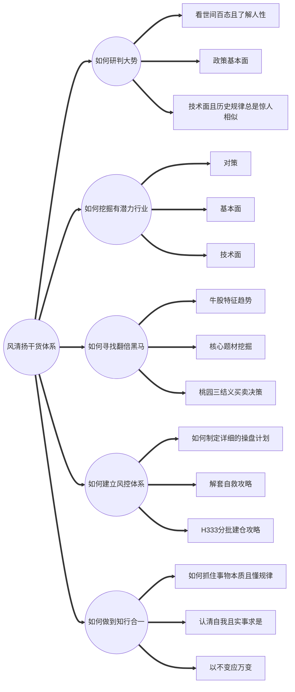

## 风清扬

历史总是惊人的相似，一定要记住当别人恐慌的时候我们一定要贪婪，当别人贪婪的时候我们一定要恐慌！

大跌之后，操作机会就是等待市场调整企稳，抢一波反弹然后等待底部到来进行中长线潜伏。所以这个时候是我们最佳的武装自己，同时也是寻找标的的时候。

风清扬干货体系

```mermaid
graph LR;
root((风清扬干货体系))
dashi((如何研判大势))
hangye((如何挖掘有潜力行业))
heima((如何寻找翻倍黑马))
fengkongtixi((如何建立风控体系))
zhixingheyi((如何做到知行合一))

root ==> dashi
root ==> hangye
root ==> heima
root ==> fengkongtixi
root ==> zhixingheyi

dashi ==> 看世间百态且了解人性
dashi ==> 政策基本面
dashi ==> 技术面且历史规律总是惊人相似

hangye ==> 对策
hangye ==> 基本面
hangye ==> 技术面

heima ==> 牛股特征趋势
heima ==> 核心题材挖掘
heima ==> 桃园三结义买卖决策

fengkongtixi ==> 如何制定详细的操盘计划
fengkongtixi ==> 解套自救攻略
fengkongtixi ==> H333分批建仓攻略

zhixingheyi ==> 如何抓住事物本质且懂规律
zhixingheyi ==> 认清自我且实事求是
zhixingheyi ==> 以不变应万变
```

