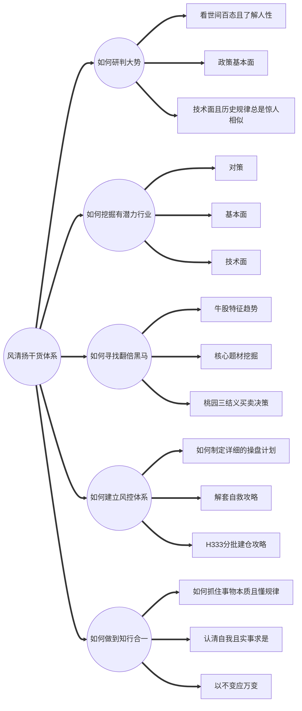

## 风清扬

历史总是惊人的相似，一定要记住当别人恐慌的时候我们一定要贪婪，当别人贪婪的时候我们一定要恐慌！

大跌之后，操作机会就是等待市场调整企稳，抢一波反弹然后等待底部到来进行中长线潜伏。所以这个时候是我们最佳的武装自己，同时也是寻找标的的时候。

风清扬干货体系

### 桃园三结义
“三结义”主要是利用三条均线组成一个操作系统，能解决很多我们在操作过程中遇到的问题
### 三结义组成
5、10、30三条均线
- 5日线叫张飞线，比较快性格像张飞
- 10日线叫关羽线，文武双全
- 30日线刘备线，纵览大局
### 第一买点B1
当三线粘合，就是“三结义”的第一买点，
5日上穿10日，
10日上穿30日，
三线基本处于一个点位的时候就是最佳买点的出现。
### 第二买点B2
当5日线和10日线在三十日线上粘合之后又拉开，就是死叉未形成，
又形成金叉，为第二买点。
### 第三买点B3
当价格回调到三十日线附近没有跌破，收阳之后可以作为第三买点。

### 第一卖出位S1
当股价跌破十日线的时候为第一止盈点位，在这里需要减仓，锁定前期的利润。
### 第二卖出位S2
当股价跌破三十日线，这时候必须卖出股票，等股价再次站上之后再买入。
